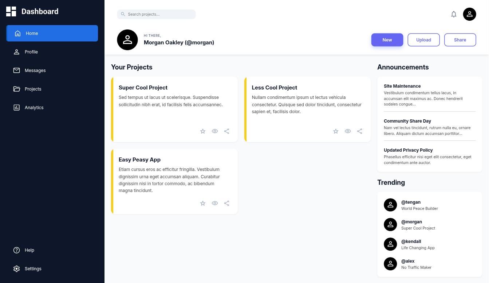

# Dashboard

This is a solution to the
[Dashboard project in the Intermediate HTML and CSS course of The Odin Project](https://www.theodinproject.com/lessons/node-path-intermediate-html-and-css-admin-dashboard).

## Table of Contents

- [Overview](#overview)
    - [Screenshot](#screenshot)

## Overview

The solution features a responsive and accessible dashbaord. The dashboard was
built using semantic HTML5 and appropriate ARIA attributes to ensure it's
usable by screen reader users and keyboard-only users.

### Screenshot

